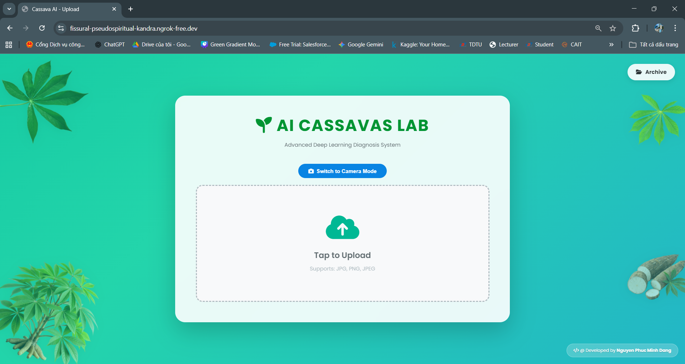
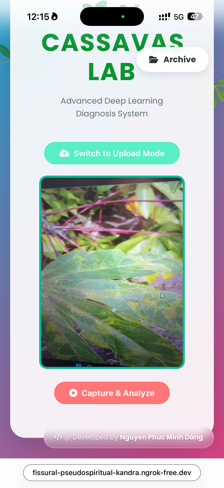
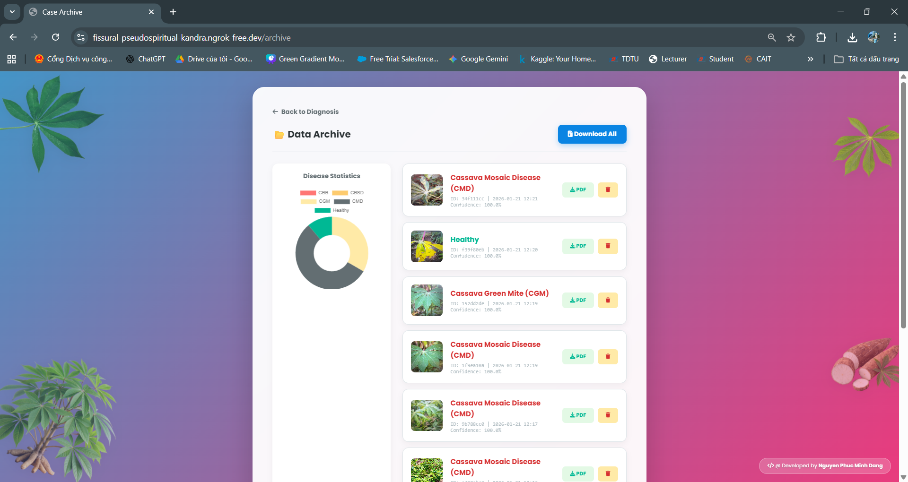

# 🌿 AI Cassava Disease Detection Lab


> **Advanced Deep Learning System** for diagnosing Cassava leaf diseases with Explainable AI (Grad-CAM) and Real-time Camera integration.

---

## 📸 Demo Preview

### ⚡ Real-time Diagnosis in Action


### 🖥️ Interface Gallery

| **Desktop UI (Upload Mode)** | **Mobile UI (Camera Mode)** |
|:---:|:---:|
|  |  |
| *Modern Glassmorphism Design with Drag & Drop support.* | *Optimized for Mobile with Rear Camera integration.* |

### 📊 Dashboard & Analytics
| **Smart Archive System** |
|:---:|
|  |
| *Automatic statistics generation (Chart.js) and history tracking.* |

---

## ✨ Key Features (Tính năng nổi bật)

* **🧠 High-Accuracy AI:** Utilizes a fine-tuned CNN model (MobileNet/ResNet) to classify 5 specific cassava leaf conditions (CBB, CBSD, CGM, CMD, Healthy).
* **🔥 Explainable AI (XAI):** Integrated **Grad-CAM Heatmap** technology to visualize exactly where the AI is "looking" on the leaf, increasing trust and transparency.
* **📷 Dual-Mode Input:**
    * **Upload Mode:** Drag & drop support for high-res images.
    * **Camera Mode:** Real-time capture supported on both Desktop (Webcam) and Mobile (Environment/Rear Camera).
* **📊 Smart Dashboard:** Automatically tracks diagnosis history and visualizes disease distribution using interactive charts (Chart.js).
* **📄 Automated Reporting:** Generates professional PDF reports with original images, heatmaps, and expert advice with a single click.
* **🎨 Modern UI/UX:** Responsive Glassmorphism design (Dark/Light mode adaptive) providing a "Lab-like" experience.

---

## 🛠️ Tech Stack

* **Core:** Python 3.10
* **Deep Learning:** TensorFlow, Keras
* **Computer Vision:** OpenCV (cv2), NumPy
* **Web Framework:** Flask (Python)
* **Frontend:** HTML5, CSS3 (Animations), JavaScript
* **Visualization:** Chart.js (Analytics), Matplotlib (Heatmaps)

---

## 🚀 Installation & Setup

1.  **Clone the repository**
    ```bash
    git clone [https://github.com/MingDanng/Cassava_WebApp.git](https://github.com/MingDanng/Cassava_WebApp.git)
    cd Cassava-AI-Lab
    ```

2.  **Install dependencies**
    ```bash
    pip install -r requirements.txt
    ```

3.  **Download the Model**
    * *Note: The model file (>100MB) is hosted externally due to GitHub limits.*
    * 👉 **[CLICK HERE TO DOWNLOAD MODEL](https://drive.google.com/file/d/1_pm68ht-MDoX1FfSkjKV21OQjphuaEUI/view?usp=sharing)**
    * **Action:** Download the file `cassava_best.keras` and place it in the **root directory** of this project (same folder as `app.py`).

4.  **Run the Application**
    ```bash
    python app.py
    ```
    Access the app at: `http://127.0.0.1:5000`

---

## 📂 Project Structure

```text
Cassava_AI_Project/
│
├── assets/                  # Demo Images (.png) & GIFs for README
├── static/                  # CSS, Images, JS
│   ├── heatmaps/            # Generated Heatmaps
│   ├── images/              # Uploaded Images
│   └── pdfs/                # Generated Reports
├── templates/               # HTML Interfaces
│   ├── index.html           # Main Upload/Camera Page
│   ├── result.html          # AI Result & Heatmap Page
│   └── archive.html         # Dashboard & Statistics
├── app.py                   # Main Flask Application
├── cassava_best.keras       # Trained AI Model (Downloaded separately)
└── requirements.txt         # Dependencies list

---

## 👨‍💻 Author
```text
**Nguyen Phuc Minh Dang**
* **Role:** Developer & AI Researcher
* **GitHub:** https://github.com/MingDanng
* **Email:** dangnguyen0303@gmail.com
* **Project:** University Capstone / Portfolio 2026
